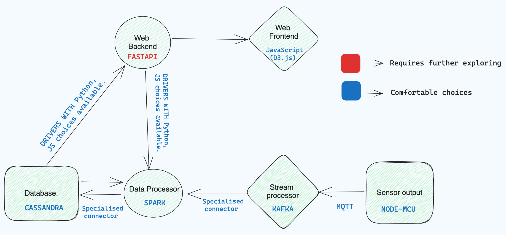

# AQvis-23
Big Data, IOT, Data analytic, Web tech project for PIL'23 and next gen Labs.
## Abstract.

Monitoring air quality in real-time and obtaining accurate data is essential for understanding pollution patterns, identifying sources, and taking appropriate mitigation measures. Traditional air quality monitoring systems, character- ized by limited data and ground coverage and high costs, fail to provide the comprehensive insights necessary for informed decision-making and effective air quality management. Consequently, there is an ever-growing need for advanced monitoring systems that can capture a broader range of air quality parameters, deliver data in real-time, and provide robust data analysis and visualization capabilities.
To address this gap, we propose an integrated air quality monitoring system that leverages IoT technology and a cloud based architecture. AQVis aims to provide a comprehensive solution that enables continuous monitoring, data analysis, and visualization of various factors contributing to air quality mea- sures. The seamless integration of our hardware and software we aim to offer a scalable and cost-effective approach to monitoring air quality, facilitating data-driven decision-making, and fostering public awareness.

## Architecture

The project leverages industry standard tools to achieve its requirements of handling big data, along with custom embedded system design to gather air characteristic data.

### Streaming platform

**Apache Kafka** 
Documentation - https://kafka.apache.org/documentation/

### Stream/batch data processor

**Apache Spark**
Documentation - https://spark.apache.org/docs/latest/

